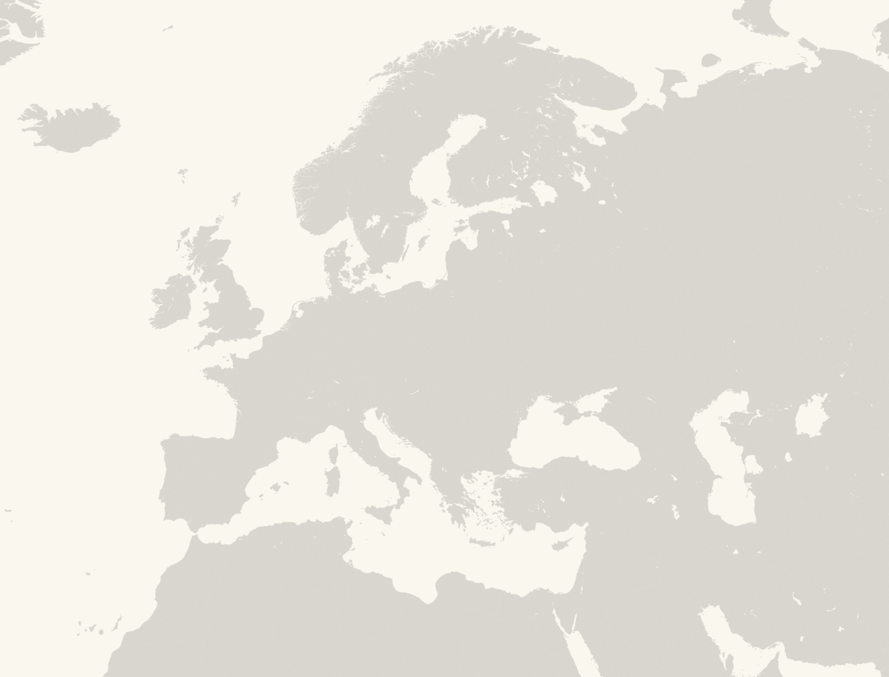
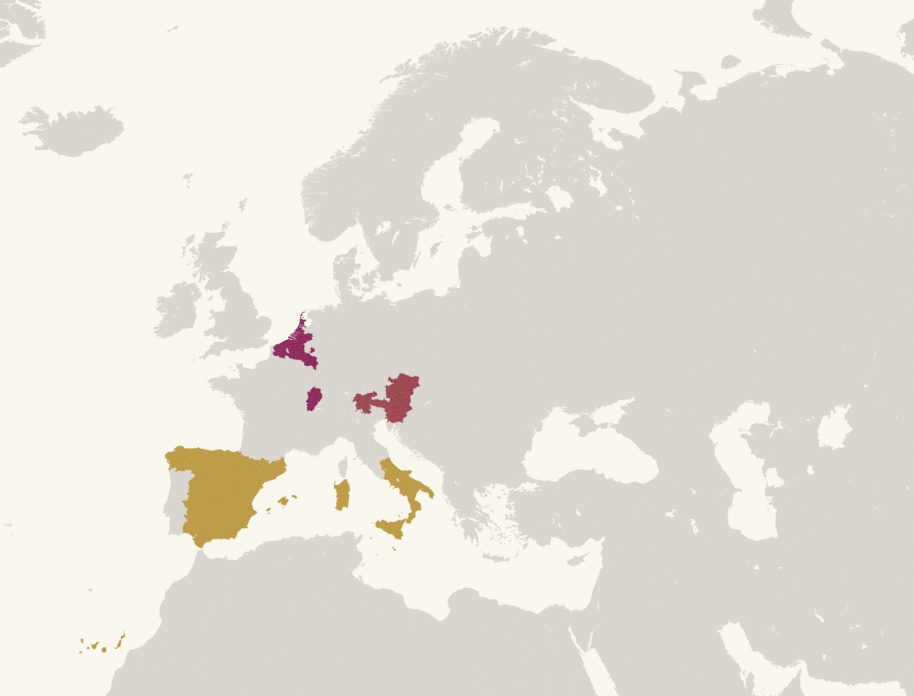
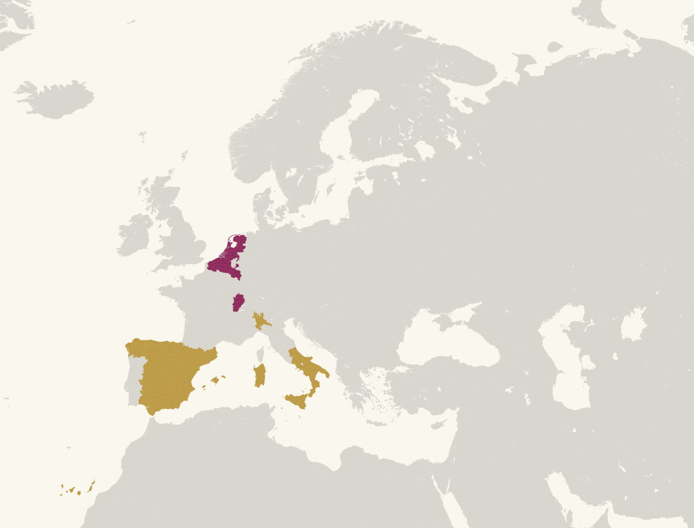

# Mapa del Atlas y laboratorio: EU V Locations

El Atlas usa **EU V Locations**, recortado a Europa, los Urales, el norte de
África y Oriente Próximo (`euv-locations-crop.svg`). **EU V Provinces**
(`src/MapChart_Map.svg`) se conserva como referencia geométrica para construir
la correspondencia histórica. El mapa de locations es más detallado, pero su
geometría no demuestra por sí sola las fronteras políticas de cada época.

La correspondencia general enlaza los 710 IDs regionales usados por el Atlas
con locations nuevas cuando al menos el 55 % del área cae dentro de la región
anterior. Las coincidencias del 25–55 % se conservan como candidatas de
revisión. Las jurisdicciones revisadas tienen capas fechadas con correcciones y fuentes
propias; estas prevalecen sobre la equivalencia general. El inspector del Atlas
muestra los gobiernos y citas disponibles. El gris significa «sin atribución
en esta base para este año», no ausencia de gobierno.



## Probarlo

El mosaico se publica junto al Atlas en `/es/mapa-completo?year=1530`.
También se puede abrir desde «¿Por qué estos colores?» en el mapa de una persona.
El build compila el visor y sus assets; no depende de servir el código fuente.


Desde la raíz del repositorio, ejecuta `./node_modules/.bin/vite` y abre
`http://localhost:5173/prototypes/euv-locations/territorial-corridors.html`
(si Vite anuncia otro puerto, usa ese número). El laboratorio abre el mosaico
en 1500 con todos los gobiernos territoriales activos que tienen geometría en
el mapa. Las capas revisadas y las aproximadas usan colores propios; las
superposiciones se rayan y la leyenda permite buscar territorios y abrir las
fuentes disponibles. Una fuente de gobierno respalda esa afirmación, no la
frontera aproximada. Las zonas sin atribución siguen grises. **Ver una
jurisdicción** conserva el análisis individual: permite escoger corredor,
entidad, año e ID, y centrar el mapa en una location.

El mapa detallado ya es el mapa normal del Atlas. Selecciona una persona y fija
un año para ver sus gobiernos; pulsa una location para abrir su ficha de
evidencia. Las capas revisadas ofrecen notas y fuentes históricas, mientras
las equivalencias automáticas se identifican como aproximaciones. Los estados
del Sacro Imperio siguen siendo referencia jurídica, no posesiones del
emperador. Los enlaces antiguos con `mapa=locations-lab` continúan cargando el
mismo mapa detallado.

El [ensayo de los dominios de Carlos V](carlos-v.html) añade un selector de
1506–1555 sobre el mapa nuevo. Permite comprobar qué cambia al adquirir las
coronas hispánicas, los territorios austríacos, Milán y los Países Bajos
septentrionales. Se conserva como recorrido analítico; el mapa de producción ya
usa el mismo recorte y las capas históricas disponibles.

La [segunda entrega, la sucesión borgoñona](burgundian-succession.html),
recorre 1419–1555 desde Felipe el Bueno hasta Carlos V. Permite buscar una
*location* y comparar pérdidas, adquisiciones y transmisiones al cierre de
cada año. Un mismo morado identifica el conjunto político borgoñón, pero la
lista lateral conserva sus condados, ducados y señoríos como jurisdicciones
distintas.

El visor integra capas regionales de Iberia, Italia, Centroeuropa, Europa
septentrional y oriental, Francia e islas británicas con versiones anuales
dentro de 1400–1650; añade los señoríos borgoñones y las capas de Hungría,
los Balcanes y el Mediterráneo oriental. El número de capas activas se calcula
para el año seleccionado. La Corona de Polonia y el Gran Ducado de Lituania siguen
separados después de 1569; los gobiernos escandinavos y bálticos, pequeños
estados rusos y enclaves también mantienen su jurisdicción y fechas propias.




El SVG recortado se reconstruye con:

```sh
python3 prototypes/euv-locations/crop_svg.py /ruta/a/MapChart_Map.svg
node --import ./tests/jsx-loader.mjs prototypes/euv-locations/audit-crosswalk.mjs
```

Para regenerar la capa de Carlos V, primero se extraen de la base sus
gobiernos fechados y las versiones del mapa de provincias de referencia. El paso geométrico
requiere `shapely` y `svgpathtools` en el entorno de trabajo; son herramientas
de generación, no dependencias del sitio:

```sh
node --import ./tests/jsx-loader.mjs prototypes/euv-locations/carlos-v-source.mjs
python3 prototypes/euv-locations/build-carlos-v-map.py --tags '/ruta/a/Texto pegado.txt'
python3 prototypes/euv-locations/render-carlos-v-svg.py 1548 /tmp/carlos-v-1548.svg
node --import ./tests/jsx-loader.mjs prototypes/euv-locations/burgundian-source.mjs
python3 prototypes/euv-locations/build-burgundian-map.py
node --import ./tests/jsx-loader.mjs prototypes/euv-locations/corridor-source.mjs
node prototypes/euv-locations/hungary-balkans-source.mjs
python3 prototypes/euv-locations/build-corridor-map.py
```

La exportación original no se incluye: el SVG adjunto por el usuario está en
`Downloads/MapChart_Map.svg`. El recorte conserva la atribución MapChart y el
laboratorio enlaza su licencia CC BY-SA 4.0.

## Encuadre comprobado

El `viewBox` es `475 15 315 240` en la proyección mundial original. Se fijó
mirando el resultado renderizado, con puntos de control en Islandia
(Keflavik, Isafjordur), norte de Noruega (Hammerfest), Urales (Pervouralsk),
Marruecos y Sáhara atlántico (Agadir, Dakhla), Egipto (Cairo), Tierra Santa
(Jerusalem) y Oriente Próximo/Medio (Baghdad, Isfahan). La ventana incluye
pequeños fragmentos árticos en los extremos superiores; eliminarlos exigiría
una máscara irregular y no reduciría de forma apreciable el peso.

El script descarta los paths fuera de la ventana, además de ajustar el
`viewBox`. Usa una caja conservadora para curvas y arcos: puede conservar
algún path apenas exterior, pero no debe perder geometría que cruce el borde.
Se desactivaron los trazos negros de cada location para evitar las rayas
internas que el Atlas no quiere mostrar.

## Tamaño y correspondencias

| | Provinces de referencia | Locations completo | Locations integrado |
|---|---:|---:|---:|
| Paths geográficos | 3.838 | 22.711 | 7.672 |
| SVG sin comprimir | 6,67 MB | 14,60 MB | 4,39 MB |
| Gzip aproximado | 2,16 MB | 4,43 MB | 1,24 MB |

El SVG integrado **descarga menos bytes** que el mapa Provinces de referencia
(1,24 frente a 2,16 MB comprimidos), aunque contiene el doble de paths. El
Atlas ya usa este recorte; las cifras de memoria y fluidez siguen siendo
métricas pendientes de medir en dispositivos móviles.

`corridor-locations.json` contiene el cruce geométrico actualizado de **710**
IDs regionales: una location nueva se asigna cuando al menos el 55 % de su
área cae dentro de la región anterior; los cruces del 25–55 % quedan anotados
para revisión y no se pintan como parte de las capas históricas revisadas.
Un nombre coincidente tampoco garantiza que una *location* cubra exactamente
la misma provincia. Por eso el inspector conserva la advertencia de precisión
y distingue el puente geométrico de las capas históricas fechadas con fuentes.

## Primer cruce histórico: Carlos V

La lista de **7.201** IDs aportada por el usuario contiene **7.198** presentes
en el recorte. Los tres ausentes (`Bear_Island`, `Horta`,
`Santa_Cruz_Flores`) quedan fuera del encuadre. Todos los IDs coloreados en
este ensayo están en esa lista. El cruce usa las jurisdicciones fechadas de
`CARLOS5` en el Atlas, localiza las provincias antiguas y asigna una location
nueva si al menos el **55 % de su superficie** coincide con esas provincias.
Los cruces de 25–55 % se excluyen y quedan anotados en los datos para revisión.
Se muestrean curvas SVG, así que el porcentaje es una aproximación geométrica;
una coincidencia espacial no prueba dominio histórico.

`carlos-v-overrides.json` registra correcciones manuales con motivo, fecha y
fuente. Entre otras, separa Utrecht y Amersfoort de Holanda hasta 1528,
Middelburg como Zelanda, Tournai como adquisición de 1521, Malinas como
señorío distinto de Brabante y Venlo/Roermond como Güeldres desde 1543.
Retira Benevento (enclave papal), Cambrai (principado episcopal), Andorra,
Biella/Vercelli (Saboya) y Malta desde su cesión a la Orden en 1530. El
ducado francés de Borgoña queda gris: Carlos conservó el título, mientras
que el **Franco Condado** sí está en morado. El Sacro Imperio no se pinta
entero por el título de emperador. Austria y Tirol dejan de colorearse tras
su cesión a Fernando.

El ensayo mantiene tres colores para **conjuntos políticos diferentes**, no
uno por persona: dorado para las coronas hispánicas y Milán desde 1535,
morado para la herencia borgoñona y las adquisiciones neerlandesas, rojo para
los territorios austríacos durante su breve gobierno. En 1548 hay **636**
locations coloreadas y ningún conflicto entre esos tres grupos en los datos
generados. El número mide polígonos del SVG, no unidades políticas.

## Segunda entrega: la sucesión borgoñona

El [mapa interactivo](burgundian-succession.html) sigue cinco titulares:
Felipe III de Borgoña (1419–1466), Carlos el Temerario (1467–1476),
María de Borgoña (1477–1481), Felipe I (1482–1505) y Carlos V
(1506–1555). Son **instantáneas al cierre del año**, no una cronología
mensual. El origen de cada tramo está en `burgundian-source.json`: gobiernos
fechados de `PERSONAS`, versiones del mapa antiguo y suplementos locales
declarados en `burgundian-source.mjs`. El cruce geométrico reutiliza el umbral
de 55 %, pero los casos estudiados se corrigen en
`build-burgundian-map.py` y `carlos-v-overrides.json` con motivo y fuente.
Cada gris significa «no atribuido en este ensayo», no «sin dueño».

| Revisión | Resultado en el prototipo | Comprobación |
|---|---|---|
| Calais y Boulogne | Fuera de Ponthieu; no se colorean por el solapamiento del polígono antiguo. | [Archivos Nacionales británicos: Calais inglés hasta 1558](https://www.nationalarchives.gov.uk/help-with-your-research/research-guides/french-lands-english-kings/) y [Inventario de Hauts-de-France: condado de Boulogne](https://inventaire.hautsdefrance.fr/dossier/IA62005335). |
| Charolais | Condado separado de Borgoña; desaparece del conjunto habsbúrgico entre 1477 y 1492 y vuelve desde 1493. | [BnF: adquisición borgoñona](https://essentiels.bnf.fr/fr/article/d22e6192-1011-4527-bf32-5ea610af1df2-heraldique-son-apogee-armoiries-devises-et-emblemes) y [Archivos de Côte-d’Or: tratado de Senlis](https://archives.cotedor.fr/v2/site/AD21/Apprendre/Atelier_du_chancelier_Rolin/Paleographie/Groupe_confirmes/Documents_etudies_en_2008-2009/Documents_1_a_3_-_Le_traite_de_Senlis_23_mai_1493_). |
| Mâcon | Condado distinguido del ducado; se incorpora al conjunto borgoñón desde 1435 y se pierde tras 1476. | [Municipio de Mâcon, diagnóstico histórico](https://www.macon.fr/fileadmin/medias/03_MACON_ET_VOUS/Urbanisme/PLU/Revision_PLU_2022/01-08_PROJET_ARRETE_DE_REVISION_DU_PLU/01_-_RAPPORT_DE_PRESENTATION/01a.Diagnostic_et_Projet_de_PLU.pdf). |
| Malinas y Tournai | Malinas figura como señorío propio; Tournai solo en el tramo de Carlos V desde 1521. | [Archivo municipal de Malinas](https://stadsarchief.mechelen.be/vandaag-in-de-mechelse-geschiedenis-het-parlement-van-mechelen-1474-) y [museo municipal de Tournai](https://mhm.tournai.be/en/tournai-a-city-with-a-rich-military-past). |
| Besançon, Montbéliard y Saint-Claude | No se absorben en el Franco Condado por proximidad geográfica: ciudad libre, posesión de Württemberg y abadía con señorío propio, respectivamente. | [Inventario patrimonial de Besançon](https://inventaire-patrimoine.bourgognefranchecomte.fr/dossier/IA25000374), [municipio de Montbéliard](https://www.montbeliard.fr/mes-sorties-mes-activites/musees-de-montbeliard/musee-du-chateau-des-ducs-de-wurtemberg/le-circuit-historique-2/) y [nota histórica sobre Saint-Claude](https://www.newadvent.org/cathen/13341a.htm). |
| Bouillon y Cuijk | Bouillon no se atribuye por defecto a Luxemburgo. Cuijk se separa de Brabante y se añade como señorío propio de Carlos V desde 1509, con fecha de investidura todavía provisional. | [Larousse: ducado de Bouillon](https://www.larousse.fr/encyclopedie/autre-region/duch%C3%A9_de_Bouillon/109685), [historia local de Cuijk](https://www.canonvannederland.nl/nl/noord-brabant/grave/keteltje) y [BHIC: Cuijk y Carlos V](https://www.bhic.nl/ontdekken/verhalen/cuijkse-heggenleggers-en-kartuizers-in-het-midden-van-de-zestiende-eeuw). |

La diferencia entre heredar y gobernar se marca también en la interfaz:
Felipe I heredó en 1482 siendo menor; la fase hasta 1493 se muestra con
un tono de regencia y el gobierno personal desde 1494. El registro actual de
`PERSONAS` lo llama «efectivo» desde 1482 y queda señalado para corrección
editorial, no modificado a escondidas en este ensayo. Véanse el
[Rijksmuseum sobre Felipe](https://www.rijksmuseum.nl/en/collection/object/Portrait-of-Philip-the-Fair-Duke-of-Burgundy--abd4bb32d07bc58b59f99db5ad95195c)
y [Habsburger.net sobre su minoría y regencia](https://www.habsburger.net/en/chapter/philip-fair-child-guarantor-cohesion-burgundy).
En 1477–1493 los títulos disputados o nominales, especialmente Artois y el
Franco Condado, permanecen grises hasta su restitución, aunque la situación
en el terreno fue más compleja; el [tratado de Senlis](https://archives.cotedor.fr/v2/site/AD21/Apprendre/Atelier_du_chancelier_Rolin/Paleographie/Groupe_confirmes/Documents_etudies_en_2008-2009/Documents_1_a_3_-_Le_traite_de_Senlis_23_mai_1493_)
sirve como hito para el mapa anual.

### Señorío de Cuijk

El ID `Cuijk` figura bajo el **Señorío de Cuijk** de Carlos V de 1509 a 1555,
sin confundirse con el ducado de Brabante. La [cronología neerlandesa
aportada](https://nl.wikipedia.org/wiki/Land_van_Cuijk_(heerlijkheid)) da
1509 como comienzo; falta localizar la investidura primaria y por eso el
año sigue marcado como provisional. Según el [Canon local de
Grave](https://www.canonvannederland.nl/nl/noord-brabant/grave/keteltje),
Grave y Cuijk se empeñaron a Floris van Egmond en 1517: el color representa
señorío superior, **no administración directa** durante la prenda. Esa fuente
atribuye a **Felipe II** el pago de 20.000 florines que puso fin al empeño en
1549, en contra de la formulación que lo atribuye a Carlos V. Una [revisión
histórica sobre Cuijk](https://www.dbnl.org/tekst/_bij005196201_01/_bij005196201_01.pdf)
sitúa en 1549 su incorporación a Brabante. El prototipo conserva el señorío
como entidad diferenciada hasta la abdicación de 1555; no deduce de esa
incorporación que toda la etapa anterior fuera un ducado homogéneo.

### Tercera entrega: Iberia e Italia

`corridor-source.json` extrae las versiones de 26 jurisdicciones ibéricas e italianas del Atlas.
`build-corridor-map.py` cruza 143 polígonos provinciales con 940 locations
candidatas del SVG recortado y conserva cada cambio anual. El umbral del 55 %
produce **candidatos espaciales**, nunca prueba de soberanía. La auditoría y
las correcciones por ID, fecha, motivo y fuente quedan en
`corridor-locations.json` y `corridor-overrides.json`. El visor muestra una
jurisdicción cada vez; sus tonos no pretenden colorear todos los títulos de
una persona como un único Estado.

Se comprobaron específicamente estas transferencias:

| Región | Cambio en el prototipo | Fuente |
|---|---|---|
| Granada–Castilla | Gibraltar pasa en 1462; Antequera en 1410; Ronda en 1485 y Loja en 1486. Las conquistas se separan del cambio de toda la provincia antigua de Málaga o Granada. | [Gobierno de Gibraltar](https://www.gibraltar.gov.gi/maritime), [Ayuntamiento de Antequera](https://www.antequera.es/municipio/historia/) y [Treccani: España](https://www.treccani.it/enciclopedia/spagna_(Enciclopedia-Italiana)/). |
| Sicilia | Malta deja de colorearse con Trinacria en 1530, tras su cesión a la Orden de San Juan. | [Orden de Malta](https://www.orderofmalta.int/news/the-national-library-of-malta-celebrates-the-orders-past-and-present/). |
| Nápoles y Estados Pontificios | Benevento deja de atribuirse a Nápoles y aparece como enclave pontificio. | [Treccani: Benevento](https://www.treccani.it/enciclopedia/benevento_(Federiciana)/). |
| Milán y Piamonte | Biella se retira de Milán durante todo el ensayo y Vercelli desde 1427; ambas se asignan a la jurisdicción saboyana de Piamonte. | [Treccani: Biella](https://www.treccani.it/enciclopedia/biella_(Enciclopedia-Italiana)/) y [Vercelli](https://www.treccani.it/enciclopedia/vercelli_(Enciclopedia-Italiana)/). |
| Ferrara y Venecia | Rovigo pasa a Venecia en 1484; se registra la interrupción de la guerra de la Liga de Cambrai y su retorno en 1516. La devolución de Ferrara al papa en 1598 no arrastra Rovigo. | [Treccani: política veneciana](https://www.treccani.it/enciclopedia/venezia-e-la-politica-italiana-1454-1530_(Storia-di-Venezia)/). |
| Istria y Dalmacia venecianas | Se añaden Pola y Rovinj en la costa istriana; Zadar desde 1409; Šibenik, Split, Brač y Kotor desde 1420 con un criterio anual conservador. Trieste, el interior de Istria y Ragusa quedan fuera. `Zara` es otro ID del SVG: la ciudad dálmata se llama `Zadar`. | [Treccani: Istria](https://www.treccani.it/enciclopedia/istria_(Enciclopedia-Italiana)/), [Dalmacia](https://www.treccani.it/enciclopedia/dalmazia_(Enciclopedia-Italiana)/) y [campaña de 1420](https://www.treccani.it/enciclopedia/le-frontiere-navali_(Storia-di-Venezia)/). |
| Italia central | Parma solo aparece como ducado separado desde 1545; Florencia deja paso a Toscana en 1569; Ferrara y Urbino se integran en los Estados Pontificios en 1598 y 1631. Piombino, Mirandola y Guastalla se excluyen de Toscana o Módena cuando eran Estados separados. | [Treccani: Parma y Piacenza](https://www.treccani.it/enciclopedia/parma-e-piacenza-ducato-di_(Dizionario-di-Storia)/), [Piombino](https://www.treccani.it/enciclopedia/piombino-ed-elba-principato-di_(Dizionario-di-Storia)/) y [Mirandola](https://www.treccani.it/enciclopedia/mirandola_(Enciclopedia-Italiana)/). |

La revisión automática comprueba que ningún ID esté en dos jurisdicciones
del mismo corredor en los años de muestra. El gris puede significar que
falta un Estado en esta entrega, no que la zona careciera de gobierno. Los
archipiélagos atlánticos de Portugal y las posesiones orientales de Venecia
están en los datos si el recorte general los incluye, aunque el encuadre
regional inicial no los muestra todos; el buscador permite centrarlos.
Quedan pendientes de cotejo cartográfico fino Saluzzo, los enclaves
italianos, las fronteras del Reino de Granada y las situaciones de control
militar intermitente.

### Cuarta entrega: Centroeuropa

Se han añadido siete jurisdicciones al mismo visor: Austria danubiana,
Austria Interior, Tirol, Baviera, Palatinado electoral, las tierras de la
Corona de Bohemia y la Corona de San Esteban. El cruce suma ahora **33
jurisdicciones**, **222** polígonos provinciales antiguos y **1552** locations
candidatas. Estas cifras miden el trabajo geométrico del generador; no son
territorios históricos documentados individualmente. El selector muestra
la nota de alcance de cada jurisdicción junto con los IDs antiguos y los
nuevos. Se revisó el encuadre visual en Austria, Baviera y Hungría, además
de comprobar las transiciones fechadas en el navegador.

| Jurisdicción | Criterio aplicado | Fuentes |
|---|---|---|
| Austria y Austria Interior | El archiducado danubiano no absorbe Estiria, Carintia, Carniola ni el litoral. Pitten y Wiener Neustadt se mantienen con la rama estiria. Trieste se muestra desde 1400 por su sujeción de 1382; Rijeka desde 1466. | [Habsburger.net: división de Neuberg](https://www.habsburger.net/en/chapter/albrecht-iii-and-nascent-land-austria), [Trieste](https://www.habsburger.net/en/locations/trieste), [Treccani: Fiume](https://www.treccani.it/enciclopedia/fiume_res-fbec9b86-8bae-11dc-8e9d-0016357eee51_(Enciclopedia-Italiana)/). |
| Tirol | Lienz se retira de Austria Interior y entra en Tirol desde la herencia de Görz en 1500. Kufstein y Kitzbühel entran desde la conquista de 1504. Brixen, Bruneck y Cavalese quedan fuera de la capa secular por sus principados episcopales. | [Archivo del Land Tirol: Lienz](https://www.tirol.gv.at/fileadmin/themen/kunst-kultur/landesarchiv/downloads/TGQ34_OCR_Gesamt_homepage.pdf), [Kufstein y Kitzbühel](https://www.tirol.gv.at/kunst-kultur/landesarchiv/archiv-quelle/18/), [Brixen y Bruneck](https://www.tirol.gv.at/fileadmin/themen/kunst-kultur/landesarchiv/downloads/Grundsteueranschlag1508-1509.pdf), [Provincia de Trento: Cavalese](https://www.ufficiostampa.provincia.tn.it/content/download/18455/374120/file/Palazzo_Magnifica_Comunit%C3%A0_di_Fiemme.pdf). |
| Baviera y Palatinado | La capa bávara reunificada comienza en 1505; la Alta Palatinado pasa del elector a Baviera en 1628. Se excluyen los obispados de Freising y Passau, la ciudad imperial de Regensburg, las plazas de Salzburg y el estado separado de Pfalz-Neuburg. El Palatinado electoral excluye Speyer, Landau, Leiningen, Leuchtenberg, Pirmasens y, desde la partición de 1410, Zweibrücken. | [Historisches Lexikon Bayerns: arbitraje de 1505](https://www.historisches-lexikon-bayerns.de/Lexikon/K%C3%B6lner_Schiedsspruch%2C_30._Juli_1505), [Alta Palatinado](https://www.historisches-lexikon-bayerns.de/Lexikon/Landst%C3%A4nde_der_Oberpfalz), [Freising](https://www.historisches-lexikon-bayerns.de/Lexikon/Freising%2C_Bistum%3A_Politische_Geschichte_%28Sp%C3%A4tmittelalter%29), [Salzburg](https://www.historisches-lexikon-bayerns.de/Lexikon/Artikel_45331), [divisiones palatinas](https://www.historisches-lexikon-bayerns.de/Lexikon/Pf%C3%A4lzische_Teilungen). |
| Bohemia y Hungría | Bohemia designa aquí la **Corona**, incluidos Moravia y sectores silesios, no solo el reino estricto. La capa húngara agrupa la Corona de San Esteban antes de Mohács, con Croacia y Transilvania. Desde 1526 se deja gris: no se adjudican todo el reino medieval ni las tierras de la Sublime Puerta a un único titular. Zadar (1409), Šibenik (1420) y Rijeka (1466) se retiran del agregado húngaro cuando pasan a otras jurisdicciones. | [Habsburger.net: las nuevas coronas de Fernando I](https://www.habsburger.net/en/chapter/ferdinand-i-new-crowns-habsburgs), [Treccani: Dalmacia](https://www.treccani.it/enciclopedia/dalmazia_(Enciclopedia-Italiana)/), [Fiume](https://www.treccani.it/enciclopedia/fiume_res-fbec9b86-8bae-11dc-8e9d-0016357eee51_(Enciclopedia-Italiana)/). |

Los límites de las locations siguen siendo candidatos geométricos. En
particular, los pequeños señoríos de la Alta Palatinado, los derechos
seculares de los obispados alpinos, el valle del Ziller y la frontera
de Croacia necesitan cartografía jurisdiccional más fina. La partición
de Hungría después de 1526 exige capas separadas para Hungría real,
Transilvania y dominio otomano, con cambios fechados; el gris actual
expresa esa revisión pendiente, no ausencia de gobierno. El siguiente
corredor prioritario era Polonia–Lituania, ahora iniciado; siguen pendientes
estas excepciones alpinas y húngaras. Las capas y su nivel de evidencia ya se
usan en el mapa público; esta documentación registra decisiones y cuestiones
que aún pueden corregirse.

### Quinta entrega: Polonia–Lituania (versión inicial)

La versión inicial añadió **seis jurisdicciones** al corredor nororiental.
La actualización actual amplía esa etapa hasta 1650. Esta capa no hereda sin más la versión
posterior a 1386 de `Polonia` en el Atlas, porque mezcla la Corona con
Mazovia antes de su incorporación, Pomerania occidental y señoríos
moldavos. Se distinguen Corona de Polonia, ducado de Mazovia, Prusia Real,
Prusia de la Orden, Prusia ducal y Gran Ducado de Lituania. Compartir
monarca o vínculo feudal no los funde en un solo territorio pintado.

| Cambio | Decisión cartográfica | Fuente |
|---|---|---|
| Mazovia | Rawa y Gostynin pasan a la Corona en 1462; Sochaczew permanece mazoviana hasta 1476, Płock hasta 1495 y el núcleo de Varsovia hasta 1526. | [Archivo Central de Actas Antiguas (AGAD)](https://agad.gov.pl/?page_id=486). |
| Prusia | La Segunda Paz de Toruń (1466) separa Prusia Real —incluidas Pomerelia, Chełmno, Warmia, Malbork, Elbląg y Dzierzgoń— del remanente de la Orden. La guerra de 1454–1466 deja varias plazas en gris porque el control cambió durante el conflicto. En 1525 el remanente se convierte en ducado, **feudo** polaco y no provincia administrada por la Corona. | [Fuente educativa polaca sobre los Jagellón](https://zpe.gov.pl/a/polskie-dynastie-jagiellonowie/D12LkQne7) y [texto de la Segunda Paz de Toruń reproducido en el portal público](https://zpe.gov.pl/a/prezentacja-multimedialna/DbYm1LK96). |
| Unión de Lublin | Podlasie, Volinia, Kiev y Bracław pasan del Gran Ducado a la Corona en la capa anual de 1569. Lituania conserva entidad propia y su núcleo no adopta automáticamente el color de Polonia. | [Registro de la Cancillería de la Corona, AGAD](https://agad.gov.pl/inwentarze/Metr_Korx.xml) y [documentos ucranianos conservados por AGAD](https://agad.gov.pl/?page_id=392). |

El mapa parte del solapamiento geométrico del **55 %** y aplica
correcciones fechadas por *location* en `corridor-overrides.json`. La
correspondencia visual se comprobó en el navegador para Prusia Real (1466),
la Corona y Lituania (1569). El norte prusiano, Mazovia y las transferencias
de 1569 tienen comprobaciones automáticas de fechas, IDs y exclusividad.
Quedan **pendientes** la frontera oriental del Gran Ducado, las oscilaciones
del litoral del mar Negro, la administración de Warmia y las ocupaciones
de la guerra de los Trece Años. Por eso se muestra solo el núcleo lituano
y la zona de las transferencias estudiadas; el gris no significa tierra
sin gobierno. La secuencia posterior a 1569 se describe en la entrega actual.

### Sexta entrega: principados eclesiásticos y ensayo integrado

Los núcleos de **Brixen** y **Bruneck**, antes excluidos prudentemente del
Tirol secular, se muestran bajo un principado episcopal propio. **Trento** y
**Cavalese/Fiemme** forman una segunda capa; Fiemme conservaba autogobierno
local bajo la autoridad superior del príncipe-obispo. **Salzburgo**, **Hallein**,
**Laufen** y el enclave de **Mühldorf** forman la tercera. Las 8 locations
identificadas son puntos de partida, no fronteras completas de los tres
estados eclesiásticos. La fuente para Brixen y Bruneck es el [Archivo del
Land Tirol](https://www.tirol.gv.at/fileadmin/themen/kunst-kultur/landesarchiv/downloads/Grundsteueranschlag1508-1509.pdf); para Fiemme, la [Provincia autónoma de
Trento](https://www.ufficiostampa.provincia.tn.it/content/download/18455/374120/file/Palazzo_Magnifica_Comunit%C3%A0_di_Fiemme.pdf); y para Salzburgo, el [Historisches Lexikon Bayerns](https://www.historisches-lexikon-bayerns.de/Lexikon/Artikel_45331).

La vista integrada del Atlas carga el recorte solo al recibir
`mapa=locations-lab`. El resto de la interfaz sigue funcionando; el mapa
normal, las preferencias guardadas y las exportaciones no se sustituyen.
El ensayo usa únicamente un año fijado por el visitante para no superponer
gobiernos vitalicios. Se comprobó en el navegador Carlos V en 1548: Madrid y
Milán adoptan el color hispánico, Utrecht y Cuijk el borgoñón, mientras
Londres y Dijon quedan grises. Pulsar Madrid abre una ficha que indica la
jurisdicción trasladada y la precisión provisional de la geometría.

La novena entrega añadió una primera secuencia fechada para **Hungría después
de 1526 y los Balcanes**, detallada abajo. La revisión actual amplía las
localizaciones a áreas regionales contiguas y añade gobiernos principescos
separados; sigue siendo una reconstrucción cartográfica aproximada, no un
deslinde jurídico de cada frontera histórica. También faltan pruebas
comparativas de memoria y fluidez en móvil.

### Novena entrega: Hungría después de Mohács y los Balcanes

El laboratorio añade trece capas complementarias, con **47 grupos de datos
fechados y enlazados a fuentes**. Tras la doble elección de 1526–1527 separa
el núcleo habsbúrgico de la Corona de Hungría, las localidades del partido de
Juan Zápolya y la administración otomana directa. La capa de Zápolya no
reclama toda Hungría oriental: distingue la competencia por la Corona de una
frontera estable. **Buda cambia de manos y queda bajo administración otomana
desde 1541**; Temesvár/Banat entra en 1552. Eger y Nagykanizsa cambian en
1596 y 1600, respectivamente. La [síntesis de la Enciclopedia Croata sobre
Hungría](https://enciklopedija.hr/clanak/madjarska) y la [historia de las
coronas de Fernando I](https://www.habsburger.net/en/chapter/ferdinand-i-new-crowns-habsburgs)
respaldan esta secuencia y la toma de Buda, Esztergom y Székesfehérvár.

**Transilvania queda como jurisdicción propia**, tributaria del sultán, no
como provincia otomana. En 1551–1555 aparece bajo una capa temporal propia de
**ocupación habsbúrgica**, no como Hungría real ni como gobierno Zápolya; el
núcleo transilvano separado vuelve desde 1556, tras el retorno de Isabella y
Juan Segismundo. El título principesco formal corresponde a una etapa
posterior, no a todos los años de la serie.
Fuentes: [Enciclopedia Croata: Transilvania](https://www.enciklopedija.hr/clanak/transilvanija)
y el estudio diplomático de la [ocupación habsbúrgica de 1551 y el regreso
de los Zápolya](https://gams.uni-graz.at/o:vrancic.introduction/sdef:TEI/get?locale=en&mode=view:transl).

La cronología distingue además el saqueo de Osijek en 1526 de su etapa de
gobierno otomano sostenido, que el estudio de fuentes turcas inicia en 1529;
Ilok y Vukovar se registran desde la campaña de 1526. Véanse el artículo
académico [Osijek en las fuentes otomanas](https://hrcak.srce.hr/en/107130)
y el estudio de [continuidad en la frontera otomana occidental](https://unis.asbu.edu.tr/yayin-detay/2_CZCuCpC_87/beyond-conquest-continuity-and-change-on-the-ottoman-western-frontier-from-the-late-15th-to-mid-16th-century/pdf%3D1).

La capa otomana se amplió de **29 a 172 celdas del mapa en 1500**: ahora
rellena zonas contiguas de Bulgaria, Macedonia, Tracia, Serbia, Albania y
Grecia en vez de señalar solo capitales aisladas. Las fechas separan la caída
del Despotado serbio en 1459 de la toma de Belgrado en 1521, así como la
captura de Tesalónica en 1430, Morea en 1460 y las plazas albanesas en 1479.
El reino de Bosnia se representa hasta su caída en 1463; la capa otomana de
Bosnia y Herzegovina se amplía por etapas, con la anexión de Herzegovina hacia
1482 y las fortalezas fronterizas fechadas aparte. Tighina se asigna desde
1538 según la entrada sobre [Bender](https://www.enciklopedija.hr/clanak/bender).
También se incorporan
**Valaquia y Moldavia como principados tributarios con gobierno propio**, no
como provincias otomanas: Chilia y Cetatea Albă cambian en 1484 y Tighina en
1538. **Croacia habsbúrgica, la costa dálmata veneciana y la República de
Ragusa permanecen separadas**. Ragusa conservó su república y pagó tributo al
sultán; la proximidad o el vasallaje no la convierten en provincia otomana.
Se contrastaron las entradas de [Serbia](https://enciklopedija.hr/clanak/srbija),
[Bosnia y Herzegovina](https://enciklopedija.hr/clanak/bosna-i-hercegovina),
[el Imperio otomano](https://www.enciklopedija.hr/clanak/osmansko-carstvo),
[Valaquia](https://enciklopedija.hr/clanak/65082),
[Moldavia](https://enciklopedija.hr/clanak/moldavija-drzava), [Dalmacia](https://enciklopedija.hr/clanak/dalmacija)
y la [República de Ragusa](https://enciklopedija.hr/clanak/dubrovacka-republika)
de la Enciclopedia Croata.

Las celdas de relieve físico —Alpes Dináricos, montes Balcanes, Ródope,
Pindo y Cárpatos— no se atribuyen a ningún soberano. La fuente del mapa
define ubicaciones, no fronteras históricas: cada selección regional es una
aproximación documentada y se evita colorear puertos venecianos, la costa de
Ragusa o los principados tributarios como territorio otomano directo.

La comprobación automática no encontró el mismo ID en dos jurisdicciones
activas de este corredor en un mismo año en las 13 capas, incluida la
transición entre Serbia y los otomanos, el reino y el sanjacado de Bosnia y
las tomas moldavas. También rechaza IDs geográficos de montañas y celdas que
no existan en el SVG recortado. Estas pruebas comprueban coherencia interna,
no exactitud de cada frontera.
Los grupos nuevos se conservan en `hungary-balkans-source.mjs` y
`hungary-balkans-locations.json`; estas capas alimentan ahora el Atlas y el
laboratorio se conserva como herramienta de revisión.

**Pendiente antes de dar esta región por revisada:** delimitar Partium y
Banat por señorío, fechar fortalezas y cambios de la Frontera Militar croata,
cotejar celdas ambiguas con mapas históricos de escala local y ampliar las
jurisdicciones venecianas, raguseas y eclesiásticas. El gris significa «sin
atribución revisada en este ensayo», no tierra sin gobierno.

### Séptima entrega: Francia e islas británicas

Diez jurisdicciones occidentales elevan el visor a **52**. No se combinan por
monarca: Inglaterra y Escocia mantienen colores y límites separados tras la
unión personal de 1603; el señorío de Man y el bailiazgo de Jersey conservan
su identidad. El mapa se inspeccionó visualmente en Francia e Inglaterra en
1500, y las transferencias fechadas tienen pruebas de IDs y exclusividad.

| Secuencia | Tratamiento en el laboratorio | Base documental |
|---|---|---|
| Francia | Las campañas de la Guerra de los Cien Años anteriores a 1453 permanecen grises hasta trazar ocupaciones locales. El ducado de Borgoña entra en el agregado francés en 1477, Provenza en 1486 y Bretaña en 1532. Béarn se incorpora desde 1620. Los feudos dentro de la monarquía todavía requieren una separación más fina. | [Archivos Nacionales británicos: tierras francesas de los reyes ingleses](https://www.nationalarchives.gov.uk/help-with-your-research/research-guides/french-lands-english-kings/), [Bibliothèque nationale de France: unión de Provenza](https://ccfr.bnf.fr/portailccfr/ark:/16871/004D22012314), [unión de Bretaña](https://ccfr.bnf.fr/portailccfr/ark:/16871/004D36F12606) y [Béarn](https://ccfr.bnf.fr/portailccfr/ark:/16871/004D36E13365). |
| Costa y enclaves | Calais se mantiene como plaza inglesa hasta 1557 y pasa a Francia desde 1558. Burdeos se muestra como plaza inglesa hasta 1450 y de nuevo en 1452; Bayonne solo hasta 1450. Jersey permanece separado de Francia y de Inglaterra, excepto su ocupación francesa de 1461–1467. | [Archivos Nacionales británicos](https://www.nationalarchives.gov.uk/help-with-your-research/research-guides/french-lands-english-kings/), [Gobierno de Jersey](https://www.gov.je/sitecollectiondocuments/life%20events/id%20citizenship%20test%20-%20jersey%20supplement%20-%2020190304.pdf). |
| Provenza y Saboya | El polígono antiguo de «Provenza» apuntaba erróneamente a Avignon y Nice. El nuevo núcleo utiliza Aix, Draguignan y Digne; Barcelonnette se atribuye a Saboya, que la recibió con el interior de Nice en 1388. | [Bibliothèque nationale de France: dedición de 1388](https://catalogue.bnf.fr/ark:/12148/cb12224467j). |
| Reinos británicos | Orkney y Shetland entran en Escocia desde 1469; Berwick es inglés hasta 1460, escocés en 1461–1481 e inglés desde 1482. Tórshavn no se muestra como Escocia. Man queda como señorío propio desde 1406. Gales está dentro del agregado inglés heredado, una simplificación que se desglosará. | [Historic Environment Scotland: Orkney](https://www.historicenvironment.scot/visit/all/maeshowe-chambered-cairn/history-and-stories/) y [Shetland](https://www.historicenvironment.scot/visit/all/jarlshof-prehistoric-and-norse-settlement/history-and-stories/), [Historic England: Berwick](https://historicengland.org.uk/listing/the-list/list-entry/1015520), [Manx National Heritage](https://manxnationalheritage.im/news/medieval-ring-declared-treasure/) y [Gobierno de las Islas Feroe](https://www.faroeislands.fo/the-big-picture/history-of-the-faroe-islands/historical-timeline). |
| Irlanda | Nueve locations señalan únicamente un núcleo urbano inglés en Dublin, Meath, Kildare y Louth. No forman una frontera continua de la *Pale*, ni representan el control inglés de toda la isla o la expansión Tudor. | [Investigación cartográfica irlandesa publicada por el Gobierno de Irlanda](https://assets.ireland.ie/documents/GIDC-SAIS_Vol_5_2_2_web_002.pdf), [archivo de Louth](https://louthcoco.ie/en/services/heritage/what_is_heritage/cultural/county_and_boroughs/). |

**Pendiente:** reconstruir la Francia feudal por gobiernos y ocupaciones
locales; separar Gales del agregado inglés antes de las leyes de unión;
fechar Noruega/Dinamarca, la expansión inglesa en Irlanda y las guerras del
siglo XVII. Un ID coincidente o un solapamiento del 55 % no prueban por sí
solos soberanía histórica. El laboratorio permite comparar jurisdicciones;
el mapa detallado integrado es ya el mapa habitual del Atlas.

### Octava entrega: jurisdicciones borgoñonas y marco imperial

El visor territorial integra las **24 jurisdicciones** de la sucesión
borgoñona ya auditada y las deja seleccionar por separado. Al cambiar de año
se observan el ducado francés hasta 1476, la pérdida o disputa de algunos
territorios después de 1477, las restituciones de 1493 y las incorporaciones
neerlandesas del reinado de Carlos V. El **ducado de Borgoña** no se convierte
en el **Condado de Borgoña** por compartir nombre; tampoco se convierte la
herencia de los Países Bajos en una provincia única del Imperio. El ensayo
termina en **1555**: la etapa de Felipe II, la revuelta y la división de los
Países Bajos exigen una secuencia propia antes de colorearlas.

El **marco jurídico del Sacro Imperio** es una capa de referencia adicional,
con **909 locations candidatas en 1512** y **807 en 1648**. Aparece en gris
medio detrás de los gobiernos efectivos al seleccionar un emperador en el
Atlas. No afirma que esas tierras fueran patrimonio suyo ni que cada una
perteneciese a un círculo imperial: Bohemia, Italia imperial y Suiza ilustran
por qué esas categorías deben permanecer distintas. Los Países Bajos del
norte y Suiza salen de este marco de referencia desde la Paz de Westfalia;
los meridionales y el Franco Condado no se borran con ellos. El solapamiento
de 55 % con provincias anteriores sigue siendo **candidato geométrico**, no
frontera legal documentada location por location. Véanse el [mapa de los
círculos de 1512](https://germanhistorydocs.org/en/from-the-reformations-to-the-thirty-years-war-1500-1648/ghdi:map-2809),
los [tratados de Westfalia](https://germanhistorydocs.org/en/from-the-reformations-to-the-thirty-years-war-1500-1648/peace-treaties-of-westphalia-october-14-24-1648)
y la [revisión del marco imperial anterior](../../docs/CARTOGRAFIA_SACRO_IMPERIO.md).

La separación entre **Corona inglesa** y **reino de Inglaterra** también se
conserva: Calais y las plazas documentadas de Guyena pueden compartir el
color del monarca inglés, pero permanecen como jurisdicciones continentales
identificables. No se infiere de ese color su incorporación institucional
idéntica a la de los condados ingleses. Los [Archivos Nacionales
británicos](https://www.nationalarchives.gov.uk/help-with-your-research/research-guides/french-lands-english-kings/)
describen por separado las tierras francesas administradas por la Corona;
los [Gascon Rolls](https://discovery.nationalarchives.gov.uk/details/r/C3621)
documentan la administración del ducado de Aquitania/Guyena.

Se usa la [serie cartográfica de IEG Mainz](https://www.ieg-maps.uni-mainz.de/map1.htm)
para contrastar el ámbito imperial, y la [ficha del Rijksmuseum sobre la
abdicación de Carlos V](https://www.rijksmuseum.nl/en/collection/object/Allegory-on-the-Abdication-of-Emperor-Charles-v-in-Brussels--2cb744f2469fe62413bb6aab920d4e03)
para comprobar que sus posesiones neerlandesas conservaban ducados, condados
y señoríos distintos. Las correcciones localizadas de la sucesión siguen
enumeradas en `burgundian-locations.json` con sus URL de fuente. El Atlas usa
por defecto el mapa EU V Locations; al pulsar una location se abre su ficha
con los gobiernos registrados y las fuentes disponibles. El parámetro antiguo
`mapa=locations-lab` se sigue aceptando como enlace, pero ya no cambia de mapa.

### Pendientes de la octava entrega (Borgoña e Imperio)

- La fecha de investidura de **Cuijk en 1509** todavía necesita contraste con
  documentación primaria. Se muestra como hipótesis fechada, con la prenda
  administrativa de 1517–1549 explicada por separado.
- **Montreuil**, **Luxeuil** y algunos bordes de Ponthieu/Franco Condado
  siguen siendo candidatos por solapamiento y requieren cotejo de cartografía
  jurisdiccional fechada antes de tratar sus geometrías como exactas.
- La restitución de 1493 y las ocupaciones de 1477–1492 no se pueden reducir
  siempre a un año y un único dueño efectivo. El estado anual conservador
  omite el control discutido; no presenta el vacío como ausencia histórica.
- El corredor es una capa trazable, no una garantía de que todas las fronteras
  de las 254 locations candidatas sean históricamente exactas. El mapa está
  integrado en el Atlas y sus límites siguen marcados para revisión.

### Límites que requieren otra pasada

- Esta es una transferencia desde provincias previas y una primera auditoría
  visual de Iberia, Italia y los Países Bajos. No es una reconstrucción de
  todas las fronteras locales de cada año. El señorío de Limburgo solo tiene
  una location identificada con seguridad en esta escala; Maastricht queda
  gris por jurisdicción compartida.
- No se incluyen posesiones americanas ni todos los presidios del norte de
  África. El recorte geográfico no debe interpretarse como el conjunto mundial
  de dominios de Carlos V.
- Las fechas de inicio se muestran por año completo. Los cambios dentro de un
  mismo año, los periodos de ocupación militar y las reclamaciones de derecho
  necesitan una capa temporal más fina y fuentes por location. La atribución
  de `Rovegno` queda suspendida hasta resolver su jurisdicción del siglo XVI.
- La siguiente fase debe cotejar las locations conflictivas contra cartografía
  académica fechada y documentos jurisdiccionales, además de probar fluidez y
  memoria en móvil. La sustitución del mapa ya está integrada; la equivalencia
  geométrica general sigue siendo provisional donde aún no hay revisión local.

Fuentes principales para las correcciones: [mundo de los Habsburgo](https://www.habsburger.net/en/chapter/charles-v-empire-which-sun-never-set),
[museo municipal de Tournai](https://mhm.tournai.be/en/tournai-a-city-with-a-rich-military-past),
[archivo municipal de Malinas](https://stadsarchief.mechelen.be/vandaag-in-de-mechelse-geschiedenis-het-parlement-van-mechelen-1474-),
[Canon de Güeldres](https://www.canonvannederland.nl/nl/gelderland/gelderland/van-graafschap-tot-hertogdom),
[Treccani sobre Benevento](https://www.treccani.it/enciclopedia/benevento_%28Federiciana%29/),
[Treccani sobre Vercelli](https://www.treccani.it/enciclopedia/vercelli_%28Enciclopedia-Italiana%29/)
y la [Orden de Malta](https://www.orderofmalta.int/news/the-national-library-of-malta-celebrates-the-orders-past-and-present/).

Las cifras de carga que muestra el navegador son orientativas de esa sesión;
no miden fluidez sostenida ni memoria móvil. El menor peso de transferencia no
compensa automáticamente el doble de nodos SVG.

## Revisión continua tras integrar el mapa

1. Resolver las equivalencias geométricas dudosas por región y periodo con
   cartografía histórica y documentación jurisdiccional.
2. Completar gobiernos y fuentes allí donde el puente geométrico aún sea la
   única base para colorear una location.
3. Medir primer dibujo, interacción, memoria y exportación en escritorio y
   móvil; conservar la estética sin límites feudales negros.
4. Actualizar las capas y los informes de cobertura a medida que se revisen
   los territorios; las incertidumbres deben seguir visibles en el Atlas.

## Novena entrega: Europa septentrional y oriental

La ampliación añade 28 capas al corredor nororiental y extiende las seis
polaco-lituanas hasta 1650. La Corona polaca y el Gran Ducado siguen separados
después de 1569: Podlaquia, Volinia, Bráclav y Kiev pasan a la Corona, mientras
Livonia entra como condominio y Curlandia permanece como ducado vasallo
autónomo. Estonia del norte queda bajo Suecia desde 1561; la mayor parte de
Livonia pasa a Suecia en 1629, mientras Latgale permanece en la Mancomunidad.
Riga se marca como ciudad —libre entre 1561 y 1580, bajo la Mancomunidad desde
1581 y bajo Suecia desde 1621—, sin extender ese punto a una frontera
provincial.

Dinamarca, Noruega y Suecia se representan como reinos distintos durante la
Unión de Kalmar y la unión danesa-noruega. Schleswig y Holstein quedan como
ducados separados del reino danés; un mismo gobernante no los convierte en
una jurisdicción. Orkney y Shetland aparecen bajo la Corona noruega hasta
1468 y bajo Escocia desde 1469. Las Feroe se muestran como dependencia noruega
con Tórshavn como marcador, sin inventar un perímetro. Gotland, Jämtland,
Halland y Ösel cambian de capa en 1645 según Brömsebro. Ösel utiliza
Kuressaare como marcador urbano, no como polígono insular. Pomerania distingue al ducado griffino, la ocupación sueca
desde 1630 y las partes asignadas en Westfalia; la frontera no se fijó hasta
1653, así que Stettin, Stolp y Koslin se usan como proxies regionales. Wismar
se representa aparte como feudo sueco, sin colorear todo Mecklemburgo.

La expansión moscovita se fecha de forma acumulativa: Yaroslavl (1463), Rostov
(1474), Nóvgorod (1478), Tver (1485), Pskov (1510), Smolensk (1514; vuelve a
la Mancomunidad en 1611 y a Moscovia en 1634), Riazán (1521) y Kazán (1552).
Los principados y repúblicas anteriores a su anexión conservan capas propias.
Nóvgorod se marca solo por su ciudad porque el mapa nuevo no ofrece un límite
regional confiable; las demás áreas derivan de provincias antiguas y no
equivalen a deslindes históricos medidos.

| Transición o jurisdicción | Criterio | Fuentes |
|---|---|---|
| Unión de Lublin (1569) | Podlaquia, Volinia, Bráclav y Kiev pasan a la Corona; Lituania permanece como entidad separada y Livonia queda como condominio. | [AGAD, exposición y texto de la Unión](https://www.agad.gov.pl/mow/unia2C_eng.pdf). |
| Estonia, Livonia y Curlandia | Estonia del norte pasa a Suecia en 1561; Curlandia nace como ducado autónomo ese año; la mayor parte de Livonia pasa a Suecia en 1629, con Latgale en la Mancomunidad. | [Estonian Historical Journal](https://ojs.utlib.ee/index.php/EAA/article/view/AA.2017.1.02), [Universidad de Letonia](https://dspace.lu.lv/items/8812084a-b442-4c43-b827-e490e42aac55), [Economic History Review](https://onlinelibrary.wiley.com/doi/full/10.1111/ehr.13410). |
| Riga | La ciudad se mantiene como marcador separado y cambia de jurisdicción en 1581 y 1621. | [Enciclopedia letona](https://enciklopedija.lv/skirklis/198863), [Museo de Historia y Navegación de Riga](https://www.rigamuz.lv/rvkm/en/ekspoz_eng/riga-history-riga-under-the-polish-and-swedish-rule-1581-1710/). |
| Escandinavia y Holstein | Los reinos de la Unión de Kalmar permanecen diferenciados; Schleswig y Holstein no se incorporan al color de Dinamarca. Orkney y Shetland pasan de Noruega a Escocia en 1469; las Feroe siguen como dependencia de la Corona noruega. Brömsebro transfiere Gotland, Ösel, Jämtland y Halland a Suecia, Halland por treinta años. | [Store norske leksikon](https://snl.no/Kalmarunionen), [Gobierno de Schleswig-Holstein](https://www.schleswig-holstein.de/DE/fachinhalte/L/landeskundegeschichte/Chronologie_Augenblicke_Landesgeschichte/1460_VertragRipen), [Historic Environment Scotland: Orkney](https://www.historicenvironment.scot/visit/all/maeshowe-chambered-cairn/history-and-stories/), [Shetland](https://www.historicenvironment.scot/visit/all/jarlshof-prehistoric-and-norse-settlement/history-and-stories/), [Gobierno de las Feroe](https://www.faroeislands.fo/the-big-picture/history-of-the-faroe-islands/historical-timeline), [Museo de Halland](https://www.museumhalland.se/hallands-historia/), [Lex: Brömsebro](https://lex.dk/Br%C3%B6msebro), [Lex: Saaremaa](https://lex.dk/Saaremaa). |
| Pomerania y Wismar | La ocupación sueca desde 1630 se distingue de la asignación de Westfalia de 1648; el deslinde local se fijó en 1653. | [Historia Pomorza](https://historiapomorza.pl/en/epoka/swedish-pomerania-1637-1815/), [texto de Westfalia](https://germanhistorydocs.org/en/from-the-reformations-to-the-thirty-years-war-1500-1648/peace-treaties-of-westphalia-october-14-24-1648). |
| Principados rusos | Nóvgorod, Tver, Pskov, Riazán y Kazán siguen separados hasta su anexión; Smolensk se retira durante el control polaco-lituano de 1611–1633. | [Cambridge History of Russia](https://assets.cambridge.org/052181/2275/frontmatter/0521812275_frontmatter.htm), [gobierno de Pskov](https://pskov.ru/region/istoriya/prisoedinenie-k-moskve), [gobierno de Tver](https://www.tver.ru/en/about/history/xv-xvii.php). |

**Límites de esta entrega.** Las unidades antiguas `North_Livonia` e
`Inner_Livonia` no siguen con exactitud las líneas de los tratados, así que
son equivalencias candidatas documentadas. El periodo acaba en 1650, antes de
la delimitación de Pomerania de 1653 y de la cesión de Blekinge, Bohuslän y
Scania a Suecia en 1658; esas transferencias no se proyectan hacia atrás. La
geometría requiere cotejo visual por *location* para afinar el mapa integrado.

### Revisión del Atlas: continuidad balcánica y límites (5 de octubre de 2026)

El Atlas incorpora 25 gobernantes y 44 mandatos nuevos, con 45 revisiones
individuales de fuentes al incluir el mandato existente de Tvrtko II.
Valaquia y Moldavia tienen autoridad registrada en cada año entre 1601 y
1650, la sucesión otomana cubre 1617–1640 y Transilvania incorpora a
Segismundo Rákóczi y Gabriel Báthory. El tributo otomano no convierte estos
principados en provincias directamente gobernadas por el sultán. Ragusa se
consulta como república con rector y consejos, sin inventar un soberano.

La ocupación de Serbia de 1439–1443 se separa de la restauración de 1444;
Argos pasa de Venecia a los otomanos en 1463 y Monemvasia en 1540. La toma de
Jajce queda fijada en 1527 tanto en los datos originales como en el Atlas.
Bosnia muestra trama durante la rivalidad de 1420–1421 y la disputa de
Tvrtko II con Radivoj de 1433–1435. La geometría sigue siendo aproximada.

Fuentes de esta revisión: [catálogo de documentos del Museo Municipal de
Bucarest](https://muzeulbucurestiului.ro/wp-content/uploads/2023/03/Catalogul-expozitiei-Secolul-al-XVII-lea-in-Documente-si-Imagini-din-Patrimoniul-MMB.pdf),
[cronología de la Sociedad Histórica Turca](https://ttk.gov.tr/osmanli-padisahlari/),
[Semendire en la enciclopedia TDV](https://islamansiklopedisi.org.tr/semendire),
[Ayuntamiento de Monemvasia](https://monemvasia.gr/2017/05/history/),
[Argos](https://enciklopedija.hr/clanak/argos),
[Stjepan Ostojić](https://www.enciklopedija.hr/clanak/stjepan-ostojic),
[Tvrtko II](https://www.enciklopedija.hr/clanak/tvrtko-ii-kotromanic) y
[República de Ragusa](https://enciklopedija.hr/clanak/dubrovacka-republika)
en la enciclopedia del instituto lexicográfico croata. Cada mandato conserva
su referencia y pasaje en `src/evidence/balkanReviewData.js`; esas fuentes no
se extienden automáticamente a fechas de nacimiento o parentescos.

Para regenerar las 13 capas balcánicas y sus 50 grupos documentados sin
recalcular las equivalencias geométricas:

```sh
node prototypes/euv-locations/hungary-balkans-source.mjs
node prototypes/euv-locations/sync-balkan-map.mjs
```

La auditoría de continuidad de 1400–1650 reduce las combinaciones región/año
sin autoridad en estas capas de 15.377 a 5.354 (65,2 %). No es una medida de
exactitud cartográfica. Permanecen pendientes los gobiernos rumanos más
tempranos, el interregno otomano de 1403–1412, Transilvania en 1603–1604 y los
deslindes de Partium, Banat y la Frontera Militar croata. La revisión otomana
se limita a estas capas balcánicas y húngaras; no reconstruye Anatolia.

Puigcerdà se verifica bajo Carlos V y se conserva en la parte hispánica tras
1659, corrigiendo la equivalencia antigua con Rosellón. Las ocupaciones
francesas de 1708–1714 y 1812–1814 llevan trama, según
[Turisme Cerdanya](https://cerdanya.org/fr/decouvrir/culture/histoire/).
Su celda no reproduce todos los municipios ni el enclave de Llívia.

El límite de zoom y desplazamiento se acompaña de un recorte real del grupo
SVG, actualizado con cada encuadre. Así, las franjas laterales del panel no
revelan el mapa mundial subyacente. Los controles se desactivan al alcanzar
el límite. La versión del mapa para modo oscuro queda para otra entrega.

## Inventario de representación

`npm run audit:atlas-coverage` comprueba cada año de cada mandato efectivo de
1400–1650 mediante el mismo alcance que usa el Atlas. El reporte
`audit-atlas-coverage-report.json` separa entidades totalmente sin relleno,
mandatos o años sin geometría y núcleos explícitamente parciales. Un núcleo
no acredita una frontera completa. Excluye del relleno personal los cargos
imperiales y mantiene aparte títulos nominales y mandatos de otros siglos.
No se suman las entidades pendientes a las capas con huecos de autoridad.

Las capas de `priority-territories-locations.json` añaden los núcleos
documentados de Herzegovina, Mistra, Lorena, Baden, ramas Welf, Chipre y
Dobruja bajo Mircea. Sus límites pendientes y sus cambios de fecha constan
en cada capa. `authorityMapScopes.js` limita los emires del interregno
otomano y a Moisés Székely a ámbitos regionales; Basta conserva su vínculo
como gobernador de Rodolfo II. Las exclusiones fechadas prevalecen sobre
inclusiones generales tanto en el mosaico como en el mapa de una persona.
